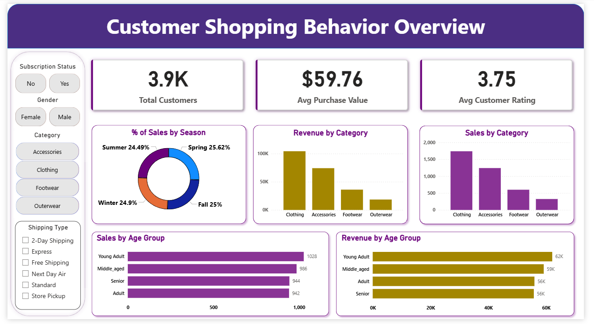

# Retail Customer Behavior and Shopping Trends

## 📌 Project Overview
This project analyzes customer shopping behavior using transactional data from **3,900 purchases** across multiple product categories. The objective is to understand spending patterns, customer segmentation, product performance, and subscription behavior to support data-driven business decisions.

The project follows an end-to-end data analytics workflow using **Python**, **SQL**, and **Power BI**, resulting in an analytical report, an interactive dashboard, and actionable business insights.

---

## 📊 Dashboard Preview

## 📌 Note on Dashboard Access
The Power BI dashboard included in this project was developed using **Power BI Desktop**.  
Due to the absence of a Power BI Service subscription, a live published dashboard link is not available.

However, the complete dashboard file (`.pbix`) is included in this repository and can be opened locally using Power BI Desktop to explore all visuals and interactivity.

📂 Dashboard File: `customer_shopping_behavior_dashboard.pbix`

  

The dashboard provides a consolidated view of customer behavior, key performance metrics, and interactive filters for deeper exploration.

---

## 🧠 Business Problem
Retail businesses generate large volumes of transactional data, but without structured analysis, valuable insights into customer behavior remain underutilized. Understanding how customers differ in spending habits, product preferences, discount usage, shipping choices, and subscription behavior is essential for improving sales performance and customer retention.

This project aims to analyze customer shopping data to uncover behavioral trends and support data-driven decisions related to marketing strategies, product positioning, and customer engagement.

---

## 🔁 Project Workflow

  

**Workflow Steps:**
1. Business problem definition  
2. Data cleaning and exploratory analysis in Python  
3. Structured analysis using SQL  
4. Interactive dashboard creation in Power BI  
5. Insight summarization and project reporting  
6. Presentation and documentation  
7. Publishing the project on GitHub  

---

## 📊 Dataset Summary
- **Records:** 3,900 customer transactions  
- **Columns:** 18 attributes  
- **Table Used:** `customer`  
- **Source File:** `customer_shopping_behavior.xlsx`

### Data Includes:
- Customer demographics (age group, gender)
- Purchase details (item, category, purchase amount)
- Shopping behavior (discount applied, previous purchases, shipping type)
- Subscription status and review ratings

Missing values in the review rating column were handled during data preprocessing to ensure reliable analysis.

---

## 🛠️ Tools & Technologies
- **Python** – Data cleaning, preprocessing, and EDA (Jupyter Notebook)
- **SQL** – Business analysis and querying
- **Power BI** – Interactive dashboard and visual analytics
- **Excel** – Raw dataset
- **GitHub** – Version control and project hosting

---

## 🔍 Key Analysis & Insights
- Male customers contributed higher total revenue compared to female customers.
- Discounts encouraged higher-value purchases rather than low spending.
- Products such as *Gloves, Sandals, and Boots* received the highest average review ratings.
- Customers using express shipping showed slightly higher average purchase values.
- Loyal customers formed the largest customer segment.
- Non-subscribers generated higher total revenue, while subscribers showed strong average spending.
- Young adult and middle-aged customers contributed the highest share of revenue.
- Several products were highly discount-dependent, indicating price sensitivity.
- A large number of repeat buyers were non-subscribers, highlighting an opportunity for subscription conversion.

---

## 💡 Business Recommendations
- Strengthen subscription programs with exclusive benefits and personalized offers.
- Apply targeted discounts for price-sensitive products while monitoring profit margins.
- Promote top-rated and best-selling products in marketing campaigns.
- Focus marketing efforts on high-revenue age groups.
- Encourage premium shipping options to increase average order value.

---

## 📂 Project Structure
Retail Customer Behavior and Shopping Trends

    ├── customer_shopping_behavior.xlsx # Raw dataset
    ├── customer_shopping_behavior.ipynb # Python analysis notebook
    ├── customer_shopping_behavior.sql # SQL queries
    ├── customer_shopping_behavior_dashboard.pbix #Power BI dashboard
    ├── Project Report.html # Project report
    ├── Customer-Shopping-Behavior-Analysis.pptx # Presentation
    └── README.md # Project documentation
    ├──assets
        ├──dashboard.png
        └──project_workflow.png

---

## ✅ Conclusion
This project demonstrates how customer transactional data can be transformed into meaningful business insights using structured analysis and visualization. The findings provide actionable recommendations to enhance customer engagement, optimize marketing strategies, and improve overall retail performance.

---

## 👤 Author
**Samir Shedge**  
Aspiring Data Analyst & Enginner | Data Enthusiast  

